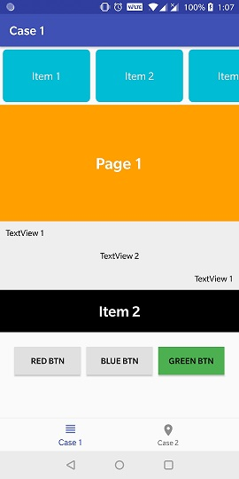
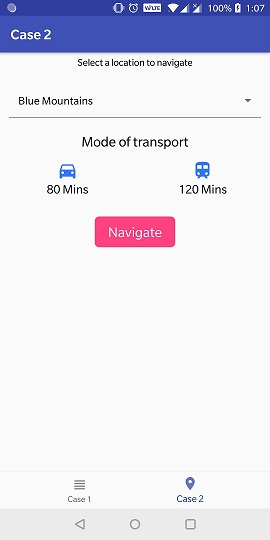
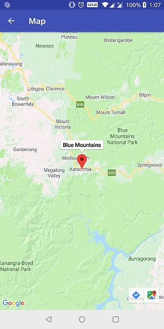

# UI-Test App
An android app to showcase different views. This app is written in both java and kotlin. There are 2 tabs in the bottom navigation menu.

* Case 1 - Contains 5 different views such as recycler view, view pager, constrain layout. This part is written in Java.
* Case 2 - Contains a dropdown of location retrieved from a URL. User can select a location and view the location in a map view. This part is written in Kotlin and MVVM architecture is used.

## Screenshots

      
